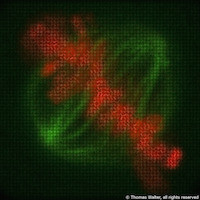
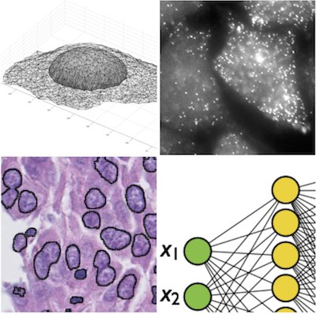

---
# Feel free to add content and custom Front Matter to this file.
# To modify the layout, see https://jekyllrb.com/docs/themes/#overriding-theme-defaults

layout: home
---

## Welcome to my homepage

I am a researcher in the field of image analysis and computer vision applied to biology. My current positions: 

- Director of the [Centre for Computational Biology](http://cbio.ensmp.fr)
- Codirector of the department [Cancer and Genome: Bioinformatics, Biostatistics, Epidemiology of Complex Systems](https://science.curie.fr/recherche/biologie-interactive-des-tumeurs-immunologie-environnement/c/)

	
    My research field is Bioimage Informatics, the branch of Computational
    Biology concerned with the computational analysis of bioimages.
    My most visible contributions have been in the field of computational phenotyping,
    applied to High Content Screening (HCS). 
    I develop computer vision and machine learning methods to quantify 
    morphological changes, classify cellular states and spatial trajectories
    from live cell imaging data with applications to systematic large-scale
    studies of cellular processes such as cell division and cell migration.
    These methods can also be used to find and phenotypically characterize new drugs.

  
    
 More recently, I have become interested in the field of spatial transcriptomics where we want to systematically study the spatial aspects of gene expression. Methodologically this involves image simulation, point cloud clustering and classification. A second axis of my current research is the computational phenotyping of cells in their tissular context in histopathology data, a very competitive field with important clinical applications. From a methodological perspective, this involves deep learning and multiple instance learning in order to analyze very large, stained tumor sections used in the clinics for diagnostic purposes, such as metastasis detection or outcome prediction.

   
    
 I also coordinate the workgroup on High Content Screening of <a href="http://france-bioimaging.org"> France-Bioimaging </a>, I am active in a number of courses on Machine Learning and Computer Vision for Biology all over Europe, and I am also one of two coordinators of the Bioimage analysis activities of the <a href="http://imabio-cnrs.fr"> GDR ImaBio </a>. 

      
  The Centre for Computational Biology is a 
  joint laboratory between <a href="http://www.mines-paristech.fr/">
  MINES ParisTech</a>, one of the most prominent French engineering
  schools, and <a href="http://www.curie.fr"> Institut Curie</a>, a
  major hospital and research center dedicated to cancer. We benefit
  from an exceptional scientific environment with immediate access to
  experts and collaborators in biology and medicine enabling a
  stimulating interdisciplinary exchange. The laboratory is located on
  the Paris campus of Institut Curie, near Pantheon.

